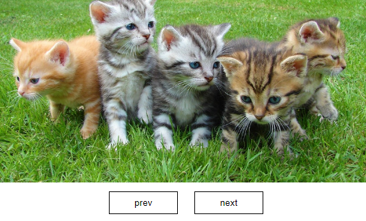

<h2>이미지 갤러리2</h2>
<h3>Gallery</h3>
<ul>
  <li> 보여질 이미지들을 html에 모두 입력하고 img의 부모 div(부모)박스에 특정 너비를 줘서 overflow-hidden 효과를 줘 보이지 않게 함</li>
  <li> onclick함수를 사용해 이전/다음 버튼을 누르면 나머지 이미지 비표시를 위해 모든 이미지에 클래스 show를 remove함 
    그 다음 현재 이미지만 표시하기 위해서 해당 사진에 클래스 show를 추가했음</li>
  <li>마지막 이미지 다음에 처음 이미지로 가게 함</li>
  <li>이미지 이동 시 페이드 효과를 줌</li>
</ul>

<h3>산출물 이미지</h3>

